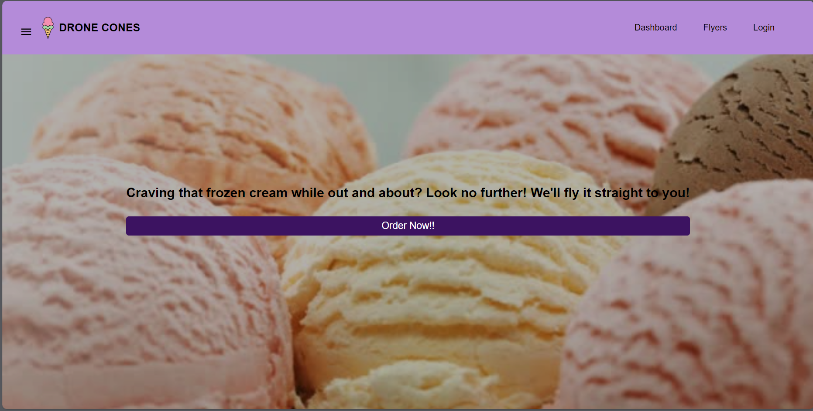
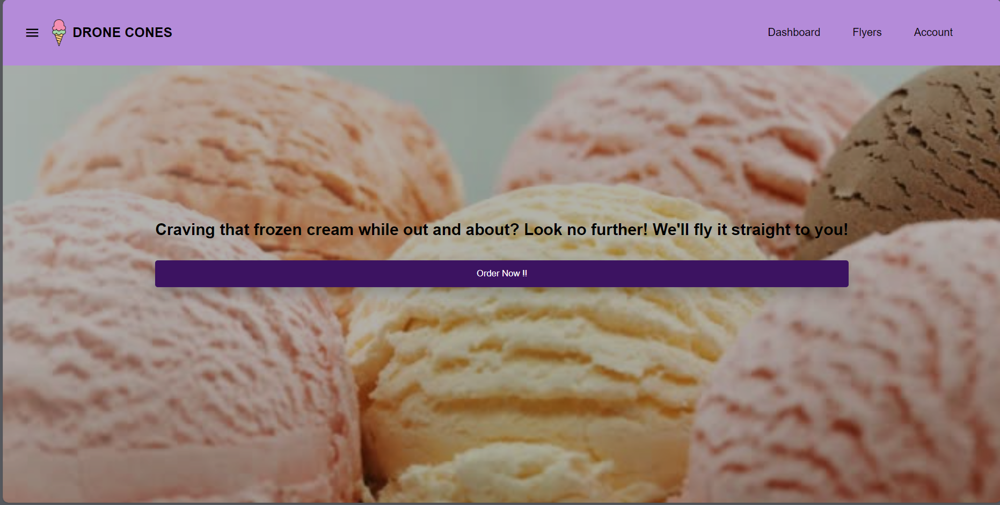
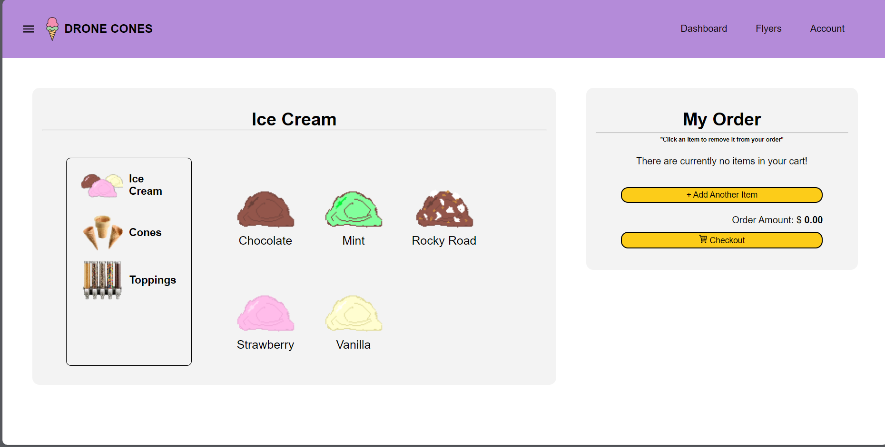
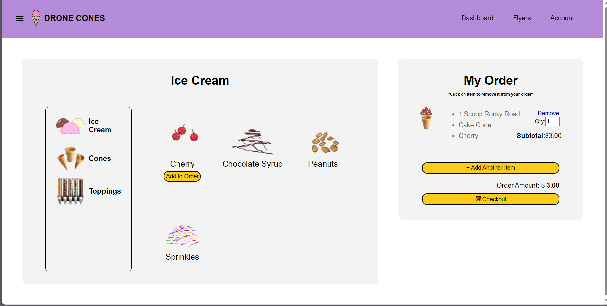
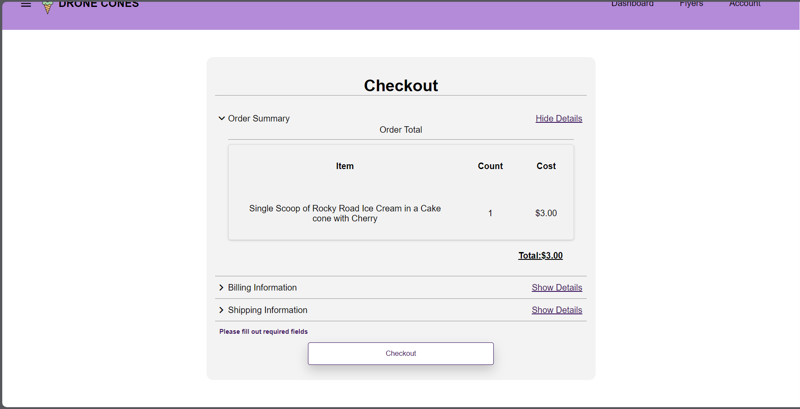

# Drone Cones
## Welcome to the drone cones app
Drone Cones is the app for Ice Cream Lovers and Sellers. 
With Drone Cones, you can turn your passion for ice cream into a profitable business, or enjoy a delicious treat delivered right to your doorstep.

In this app manual, you will learn how to use Drone Cones to:

* Set up a User profile 
* Browse and order from a variety of ice cream flavors and toppings
* See an order history 
* Manage your inventory 
* Manage your drones
* Give custom feedback 

## Creating a profile 
From the nav bar click on the Login button in the top right corner.

From the login 

## Orders 
When you are ready to place an order click on the large "Order Now" button located on the homepage. 

This will redirect you to the order screen.

To start an order, select the icon with your flavor of ice cream and create a cone based on this. This example has a Rocky Road with cherries and a cake cone. 

You may add more cones to your order by selecting " + Add Another Item". When you are ready to proceed with your purchase click the Checkout button on the right. A checkout screen with your total, and a selection of payment details will be displayed. 
Fill out each section of the forum and select checkout to finish your order

## Admin Page

## Flyer Page
To sign up as a flyer, click the Flyer tab located on the nav bar of each page 

Then select Sign Up
