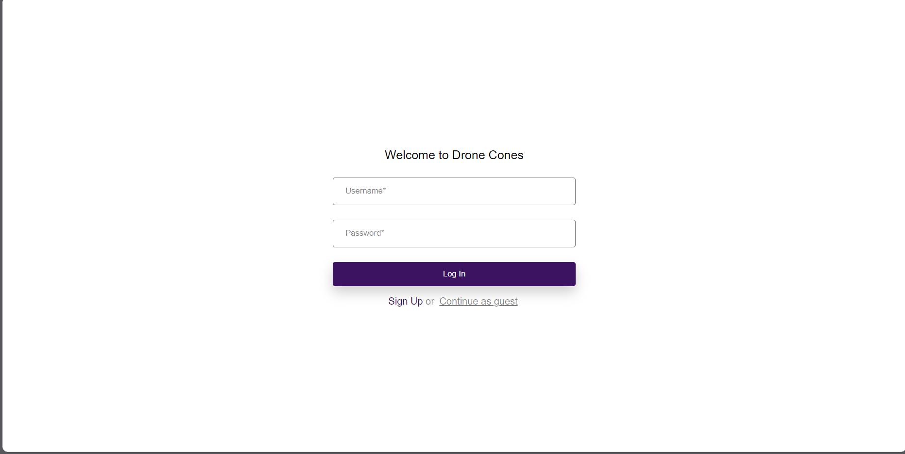
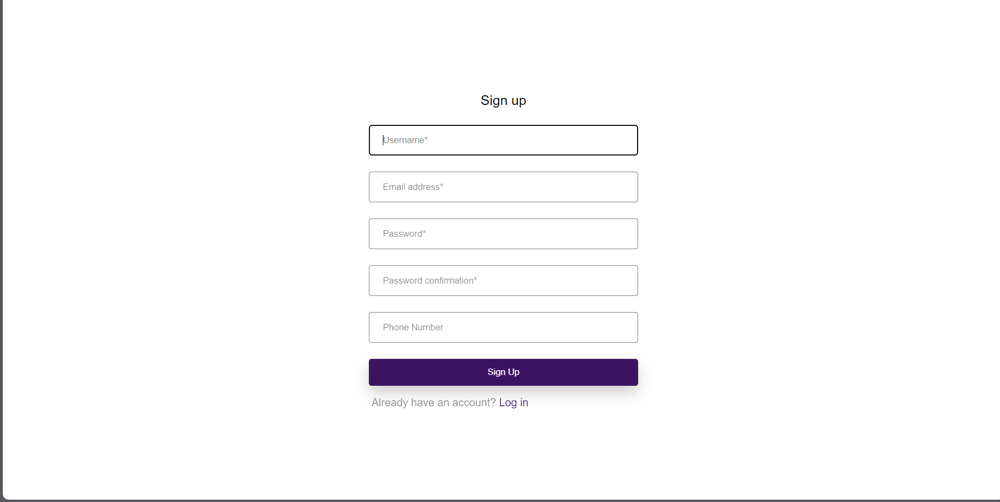
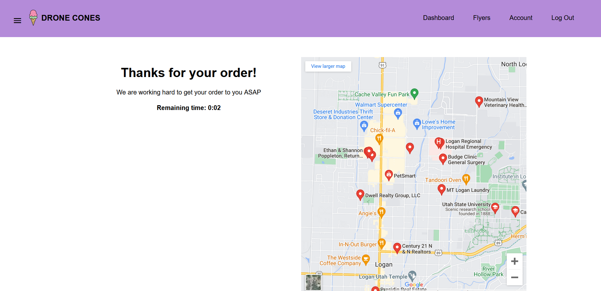
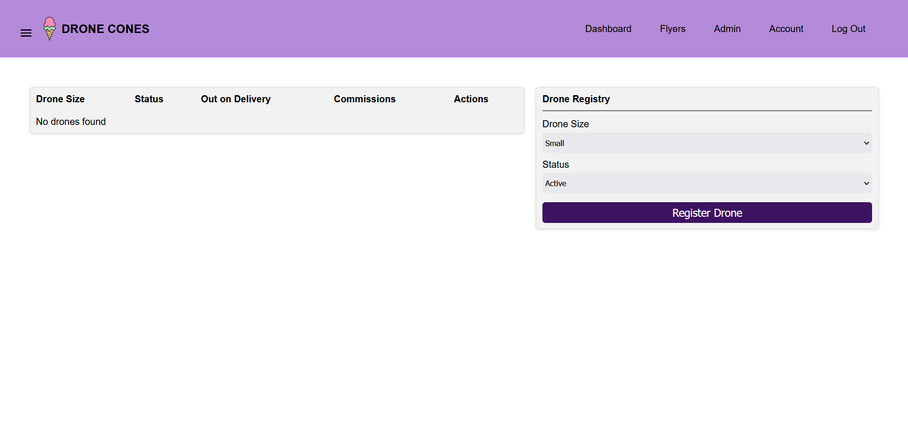
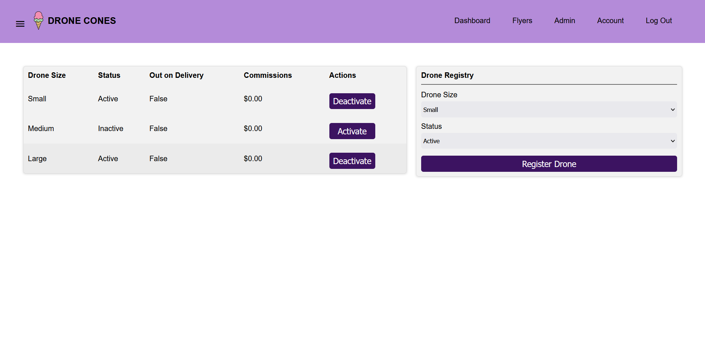
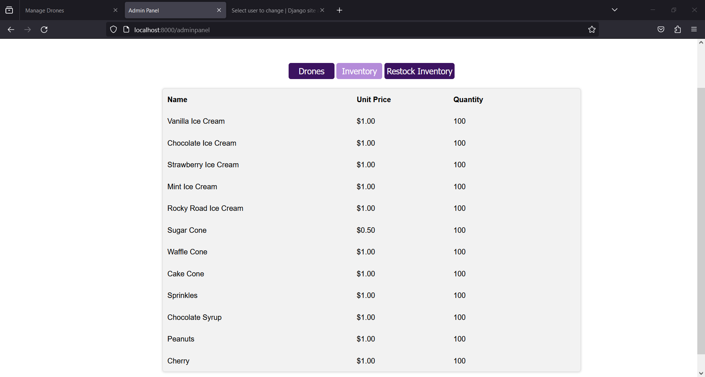
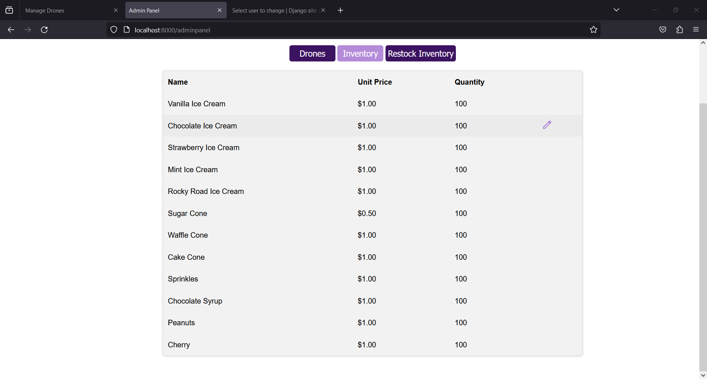
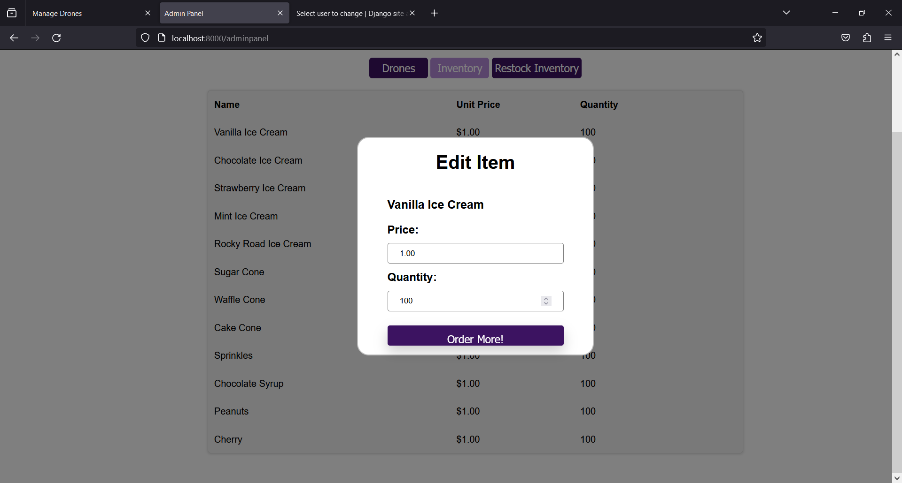
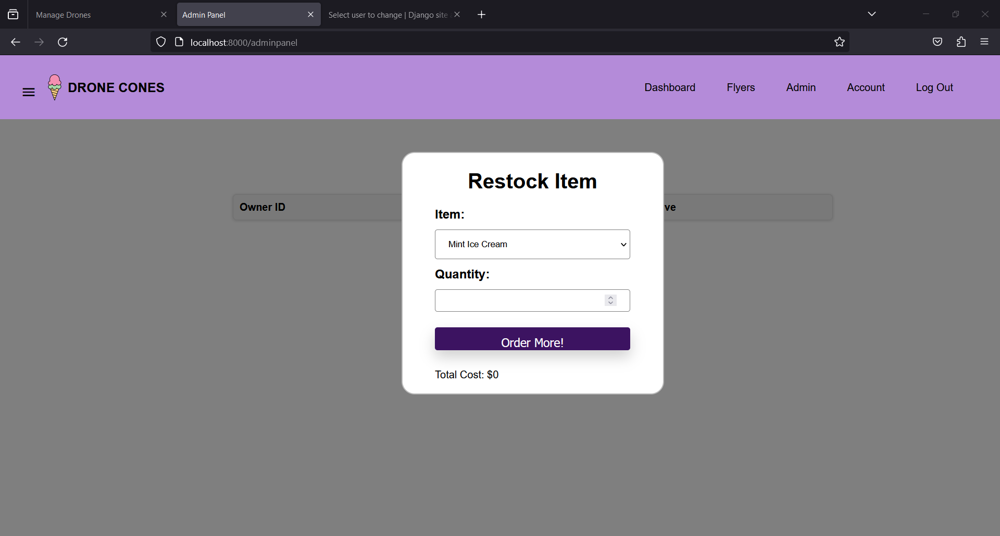
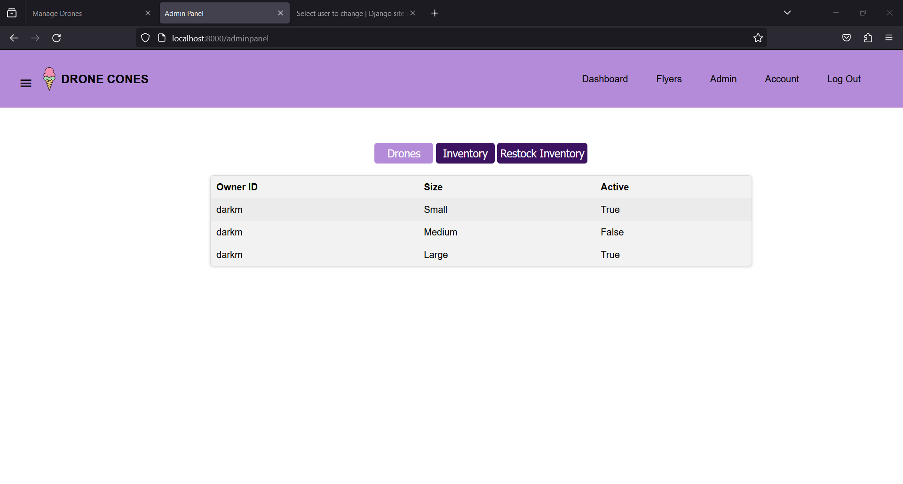

# Drone Cones
## Welcome to the drone cones app
Drone Cones is the app for Ice Cream Lovers and Sellers. 
With Drone Cones, you can turn your passion for ice cream into a profitable business, or enjoy a delicious treat delivered right to your doorstep.

In this app manual, you will learn how to use Drone Cones to:

* Set up a User profile 
* Browse and order from a variety of ice cream flavors and toppings
* See an order history 
* Manage your inventory 
* Manage your drones
* Give custom feedback 

## Creating a profile 
From the nav bar click on the Login button in the top right corner.

From the login screen, under the form there is a link labeled "sign up". Select it, and proceed to fill out the form on the following page. 

Once done click the Sign Up option to create your new drone cones account.

## Orders 
When you are ready to place an order click on the large "Order Now" button located on the homepage. 

This will redirect you to the order screen.

To start an order, select the icon with your flavor of ice cream and create a cone based on this. This example has a Rocky Road with cherries and a cake cone. 

You may add more cones to your order by selecting " + Add Another Item". When you are ready to proceed with your purchase click the Checkout button on the right. A checkout screen with your total, and a selection of payment details will be displayed. 
Fill out each section of the forum and select checkout to finish your order

A timer will appear to indicate the approximate wair time for delivery.

## Flyer Page
To sign up as a flyer, click the Flyer tab located on the nav bar of each page 

Then select Sign Up. You'll then be redirected to a page to register your drones. 

To register a new drone, select the appropriate configuration under Drone Registry, then select 
" Register Drone ". Your currently registered drones will then appear on the left.

Each drone has an active or inactive status, whether it is currently in use, and the profit of a drone. To prevent a drone from being used in the sytem simply click DEACTIVATE on the drone. To Activate, select Activate. Deleting a drone currentlt is not permitted as tracking the drones income is essential. 

## Admin Page
to access the admin panel, you must be registered as a site admin. This can be done by your it in the admin page that is provided with django. Once an admin, go to the /adminpanel page using the url bar as in the example

Once in the admin panel, you'll be able to manage drones, Manually change prices and quantity of products, and restock a product. To edit a product, hover over the item. and click the pencil icon.

You will see the following menu. The price is put as a Dollar.Cent value, and the quantity will be the total current quantity. You can increase or decrease the stock. 

Additionally the restock option lets you quickly restock an item.

Currently the drone tab is for viewing registered drones only
