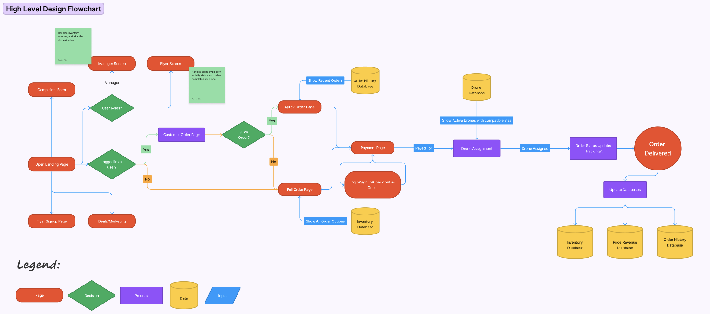
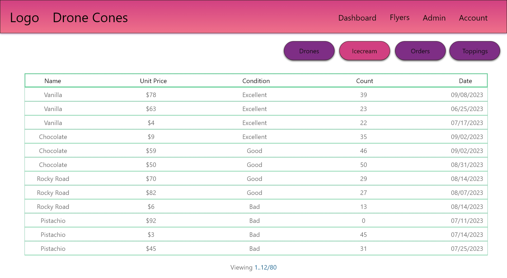

# Development Phase 1

## Security Risks
The majority of security concerns will be handled by the Django Framework, but we as developers will always be looking for more ways to increase security of thr application. 

### Database
Like with any application, the data this program will store it it's database is very important and needs to be protected.
As developers, we must take steps to ensure that our users data and our data is safe.
We will do this by correctly storing sensitive information within our database, 
as well as correctly storing keys and tokens that our application will use to interact with other services. 
We will do this by utilizing Djangos built in Hashing features and environment variable storage systems. 

### HTML Forms
HTML forms are a fundamental part of web development, enabling user interaction and data submission. 
However, they also introduce various security risks that developers need to be aware of to ensure the safety of their applications.

#### 1. **Cross-Site Scripting (XSS):**

   HTML forms are susceptible to XSS attacks when user input is not properly validated or sanitized. 
   Malicious scripts can be injected into form fields, and if not properly handled on the server side, 
   these scripts can be executed in the context of other users' browsers, leading to data theft or unauthorized actions.

#### 2. **Cross-Site Request Forgery (CSRF):**

   CSRF attacks occur when a malicious site tricks a user's browser into making unintended requests to a different site where the user is authenticated.
   If forms lack adequate anti-CSRF tokens, attackers can submit malicious requests on behalf of authenticated users, leading to unauthorized actions.
   This should be adequately handled by Django, but deserves further testing. 

#### 3. **Injection Attacks:**

   Poorly validated or sanitized input can result in injection attacks. 
   For example, SQL injection can occur if user input is directly incorporated into database queries, leading to unauthorized access or data manipulation.
   This could be a huge issue if someone were to access the admin panel, where the inventory can be manipulated via input from the user. 

#### 4. **Data Validation and Sanitization:**

   Inadequate validation and sanitization of form data can open doors to various security issues. 
   Developers should validate input on both the client and server sides to prevent malicious data from reaching the application.

#### 5. **File Upload Vulnerabilities:**

   File upload forms are particularly susceptible to security risks. Without proper validation and restrictions,
   attackers might upload malicious files, leading to potential security breaches or the execution of harmful scripts on the server.
   This could be an issue if we allow the admin to submit image files for new inventory items, such as a new ice cream flavor. 

#### 6. **Insecure Transmission:**

   If form data is transmitted over insecure channels (HTTP instead of HTTPS), it can be intercepted and manipulated by attackers, 
   compromising sensitive information such as login credentials or personal data. We need to make sure that all traffic is handled
   through HTTPS.

#### 7. **Client-Side Security:**

   Relying solely on client-side validation is risky, as malicious users can manipulate or bypass it. 
   This will be tested heavily during the Testing and Debugging phase. 

#### 8. **Sensitive Information Exposure:**

   Inappropriately handling sensitive information in forms, such as passwords or personal details, can lead to data leaks. 
   We need to make sure that passwords, emails, and addresses are stored securely without access from the front-end.

## User Interface
### Admin
### Flyer Portal
### 

#### Overall Flowchart

#### Checkout Screen

- Manager 
    - Inventory with editable values 
    - History???
#### Inventory Screen

- Flyer 
    - Drone management ( Managers have access ) create new drone 
    - Order cue 
#### optional 
- About 
-   Track your order 

## Programming Language/Framework
#### Server Side:
- Django
#### UI Side:
- Vue
- Javascript
- HTML
- CSS
#### 3rd Party Interfaces
- Google Maps API
## Data Architecture
- Monolithic. Django can be considered a monolithic architecture as all the components are integrated including the use of the dbsqlite database.
## Database Tables:
**User Table**
- Email
- ID 
- Password
- User role (Consumer, Flyer, Admin)

**Price Table**
- Item  ( IE 1 scoop 2 scoop )
- Price 

**Order History Table**
( Max history size in testing)
- Keeps track of orders and users via foreign keys
- (Track 5 previous orders)
- Order number 
- User ID 
- Sale price 
- Drone ID

**Drone Table**
- Email or User ID 
- size 
- Drone ID
- Active status ( Like are you on vacation?)
- On order / in use or free 
- Orders carried / flight time  ( Compensation for our app )
- Max Battery / max mileage ( Ask about how we measure battery life )

**Inventory Table:**
- Inventory with 'type' column
- Item name 
- Amount 
- units ( stored as servings) 
- cost per unit (maybe )

[Definitions Here](https://gitlab.cs.usu.edu/erik.falor/fa23-cs3450-lecturenotes/-/tree/master/Module2/Lec09-Mon_Sep_18?ref_type=heads)
## 3rd Party Interfaces
-- What other interfaces should we use? (This might fit under the umbrella of programming language/framework)
- Google Maps API
