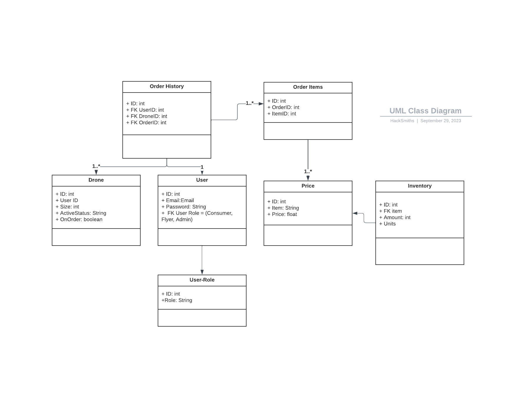
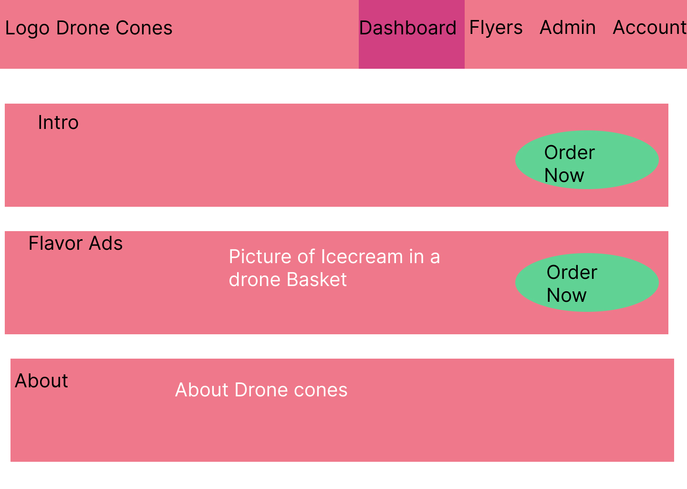
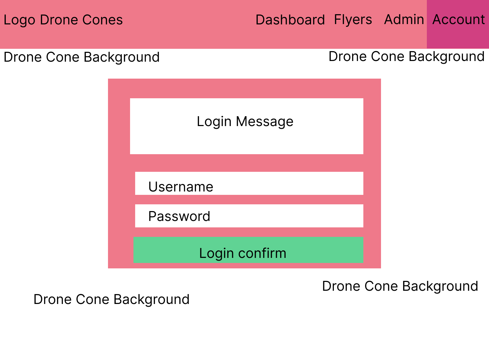

# Low Level Design

### Overall Flowchart

### UML Models

### Screens

Screens list/summary

  <ul>
    <li>Home screen</li>
    <li>Login/sign-up page</li>
    <ul>
        <li>account details</li>
        <ul>
            <li>Passwords, points, history </li>
        </ul>
    </ul>
    <li>Apply Tab ( Flyer applications at minimum) ( Can be the flyer tab)  ( for now mark off a checkbox to immediately become a flyer)</li>
    <li>Form for complaints and questions</li>
    <li>Order screen with options</li>
    <ul>
        <li>payment ( Instant, no qualifying)</li>
    </ul>
    <li>Manager</li>
    <ul>
        <li>Inventory with editable values </li>
        <li>history</li>
    </ul>
    <li>Flyer</li>
    <ul>
        <li>Drone management ( Managers have access ) create new drone</li>
        <li>Order cue</li>
    </ul>
    <li>About (optional)</li>
    <ul>
        <li>Track your order</li>
    </ul>
  </ul>

 

#### Checkout Screen

#### Inventory Screen

#### Account Management Screen

#### Home Screen

#### Login Screen

#### Order Screen

#### Drone Registry Screen

#### Slide show of user routes 
[Routes](https://docs.google.com/presentation/d/1CbbD3D4-nNw4MHQT_qBcuUm3cFirNkc7sVXrrTbp37M/edit?usp=sharing)