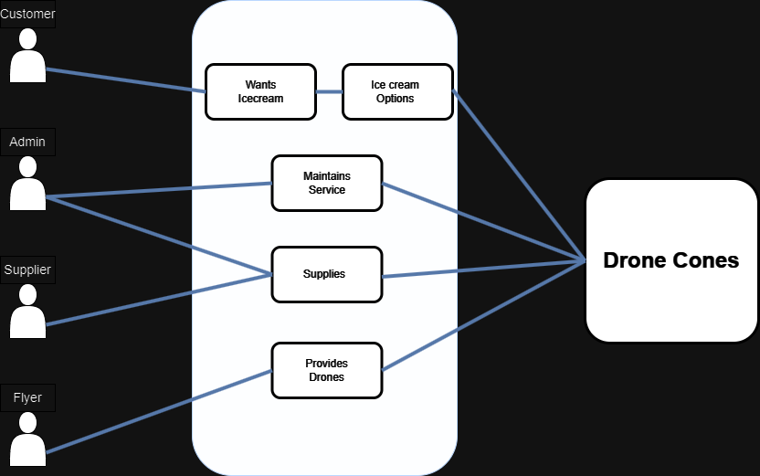

# Requirements

## Base Requirements

- The ability to create an account/login or continue as guest
- Contact forum to report incidents, etc.
- Notification system
- Ice cream has a variety of flavors (at minimum 4)
- Different drone sizes (small, medium, large)
- Drone capacity (small = 1, medium = 4, large = 8)
- User account
    - The ability to order ice cream
    - "Track the order"
    - "Pay for the order"
- Flyer account
    - Register as a flyer
    - Compensation based on distance, time, etc.
    - Check compensation
- Admin account
    - Check inventory
    - Manage inventory
 
## MoSCoW Requirements

**Must-Haves:**
- A location API that tracks each drone and sends email updates on order progress 
- A secure payment system
- A separation of classes for drone size (small, medium, and large) capable of carrying different order sizes 
- A UI which allows users to pick between a minimum of 4 flavors
- Use the same size cone for every order
- Different account types for "customers" and "flyers"
- Account holder and Guest checkout modes
- The ability to add/remove drones in a "flyer" account

- Manager database tracks inventory of based on orders
- Customer support forum for users to specify an issue that gets stored in the database

**Should-Haves:**
- Max distance for an order based on drone battery
- Set base delivery time that changes based on distance from Drone Cone location
- Point system for ordering from an account, rather than a guest checkout
- The ability to assign multiple drones to a large order
- A specific list of compatible drone types 

**Could-Haves:**
- Marketing emails and deals for Account holders
- Discounts/deals for "Flyers"
- Real-time location tracking via map, instead of sending updates via email
- SMS updates alongside email updates

**Won't Have (this time):**
- The ability to tip a "flyer"
- Automatic detection of the closest branch, seeing that there is only one branch
## User Stories
### User
- As a user, I want a variety of options for my ice cream. Such as mint chocolate chip or fudge brownie 
  - DOD (Definition of Done): Each admin is required to add at least 4 ice cream flavors when they register.
- As a user, I would like to see my order history and have the ability to quickly reorder an order from my history
  - DOD: Last 5? orders are saved in a list and can be selected. This will place the order without having to change any of the options.
- As a user, I would like to see how long until the drone will be delivering my ice cream
  - DOD: A countdown will appear showing how long until the order is expected (static) and a 'map' showing how far the drone has to go.
- As a user, I would like to have more than one flavor of ice cream per cone.
  - DOD: On the order screen, the user has the option to add another scoop of a different flavor. It can be the same flavor as the first scoop or no second scoop at all
- As a user, I would like to earn points to incentivize me to order more
  - DOD: Users earn one point fer every dollar spent and are able to see their points when they log in.

### "Flyers" 
- As a flyer, I would like to be compensated by flight time or distance
  - DOD: Flyers are 'compensated' by distance. Distance can probably be randomized. Earnings are shown on a tab on Flyer accounts.
- As a flyer, I would like to be able to add a new drone to the service
  - DOD: On the Flyer view, Flyers are able to add a drone and specify the size

- As a flyer, I would like to be able to remove my drone from the service
  - DOD: On the Flyer view, Flyers are able to remove a drone after it has been added.

### Developer/Admin
- As an admin, I would like the ability to check inventory so I can know when I need to order more stuff
  - DOD: Inventory is incremented on each order. There is a some notification when certain items need to be reordered.
- As an admin I would like to see the revenue breakdown (Totals for types of ice-cream sold)
- As an admin I would like to see the order history and information for every order and client
- As a developer, I need flyers to classify their drones as 'small', 'medium', or 'large' so we can assign a capacity to each drone
  - DOD: small have a capacity of 1, medium have a capacity of 4, and large have a capacity of 8.
- As a developer, I need to have an inventory of drones that are available for use so when an order comes in the app will know what size of drone to send, or how many to send
  - DOD: When an order comes in, drone(s) are selected automatically from the drone inventory. If no drones are available, it will wait until one is available.

## Use Cases

