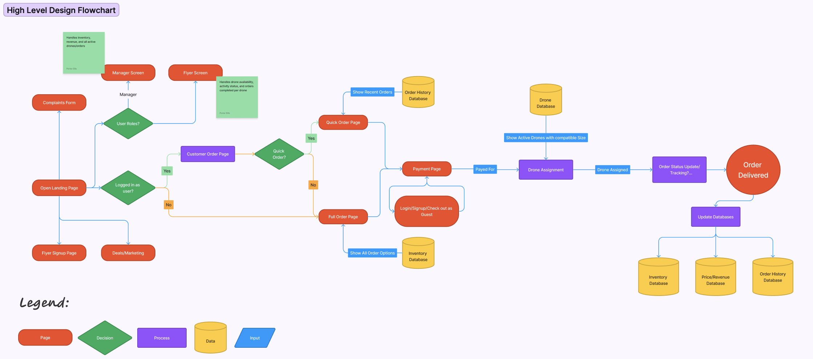
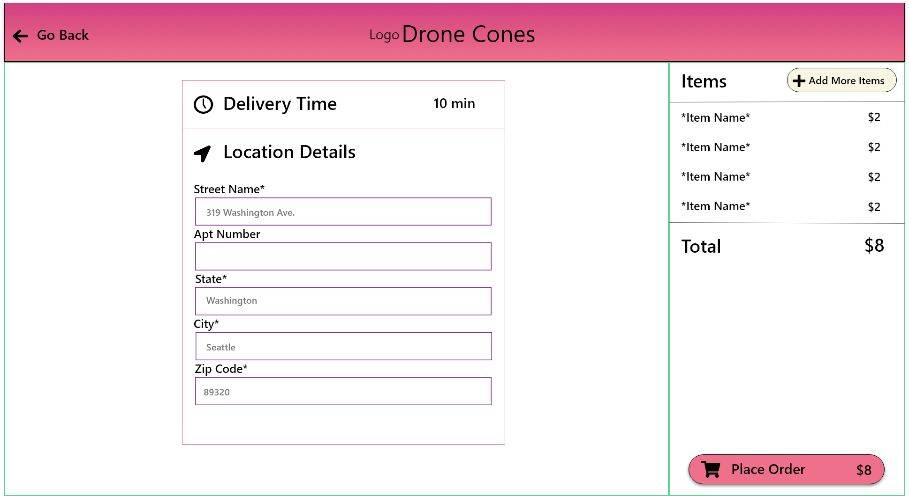

# High Level Design

## Security Requirements
- The majority of security concerns will be handled by the Django Framework, but we as developers will always be looking for more ways to increase security of thr application. 
### Application
- Since this is going to be application that is stored on the web, anyone can use it. With this in mind, we need to make sure that users are not able to interact with data that is not theirs and that they are not able to commit any acts that could harm the application as a whole. We will do this by scoping data and views to the correct user and user types, as well as sanitizing any data that users input before running any code based off of it. 
### Data
- Like with any application, the data this program will store it it's database is very important and needs to be protected. As developers, we must take steps to ensure that our users data and our data is safe. We will do this by correctly storing sensitive information within our database, as well as correctly storing keys and tokens that our application will use to interact with other services. We will do this by utilizing Djangos built in Hashing features and environment variable storage systems. 

## Target Platform
- The target platform for this application with be the web via mobile phones, tablets, or desktops.
## User Interface

### Screens
- Home screen 
- Login/sign-up page it 
    - account details 
        - Passwords, points, history 
- Apply Tab ( Flyer applications at minimum) ( Can be the flyer tab)  ( for now mark off a checkbox to immediately become a flyer)
- Form for complaints and questions 
- Order screen with options 
    - payment ( Instant, no qualifying)
#### Overall Flowchart

#### Checkout Screen

- Manager 
    - Inventory with editable values 
    - History???
#### Inventory Screen

- Flyer 
    - Drone management ( Managers have access ) create new drone 
    - Order cue 
#### optional 
- About 
-   Track your order 

## Programming Language/Framework
#### Server Side:
- Django
#### UI Side:
- Vue
- Javascript
- HTML
- CSS
#### 3rd Party Interfaces
- Google Maps API
## Data Architecture
-- What architecture should we use? 
- Monolithic,
- Client/Server,
- Component-Based,
- Service-Oriented, 
- Data-Centric,
- Event-Driven,
- Rule-Based,
- Distributed
- 
## Database Tables:
**User Table**
- Email
- ID 
- Password
- User role (Consumer, Flyer, Admin)

**Price Table**
- Item  ( IE 1 scoop 2 scoop )
- Price 

**Order History Table**
( Max history size in testing)
- Keeps track of orders and users via foreign keys
- (Track 5 previous orders)
- Order number 
- User ID 
- Sale price 
- Drone ID

**Drone Table**
- Email or User ID 
- size 
- Drone ID
- Active status ( Like are you on vacation?)
- On order / in use or free 
- Orders carried / flight time  ( Compensation for our app )
- Max Battery / max mileage ( Ask about how we measure battery life )

**Inventory Table:**
- Inventory with 'type' column
- Item name 
- Amount 
- units ( stored as servings) 
- cost per unit (maybe )

[Definitions Here](https://gitlab.cs.usu.edu/erik.falor/fa23-cs3450-lecturenotes/-/tree/master/Module2/Lec09-Mon_Sep_18?ref_type=heads)
## 3rd Party Interfaces
-- What other interfaces should we use? (This might fit under the umbrella of programming language/framework)
- Google Maps API
