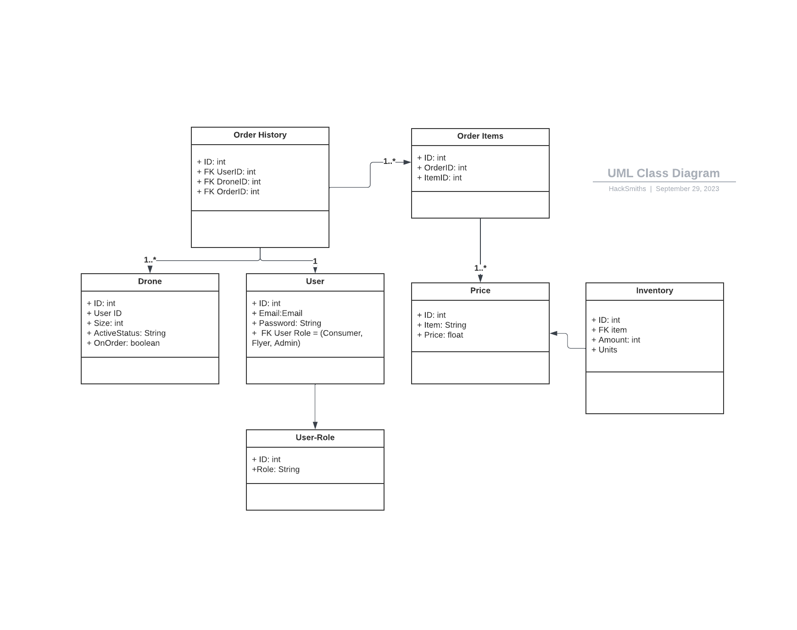
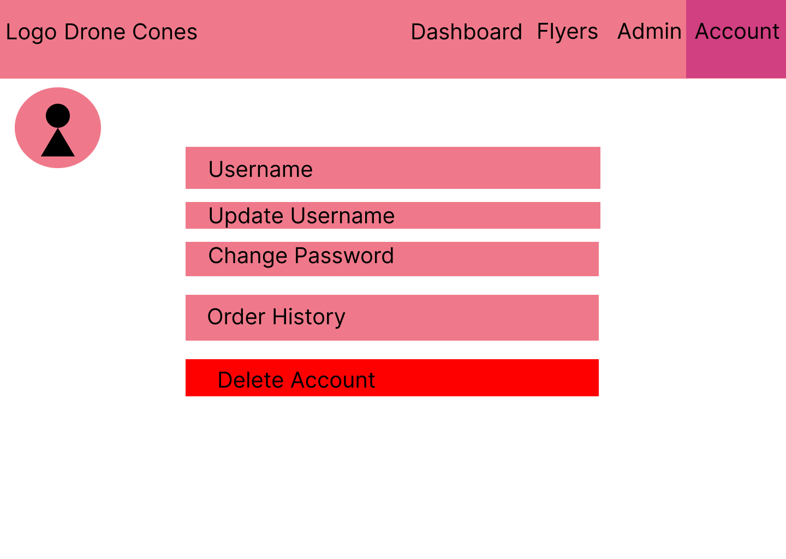
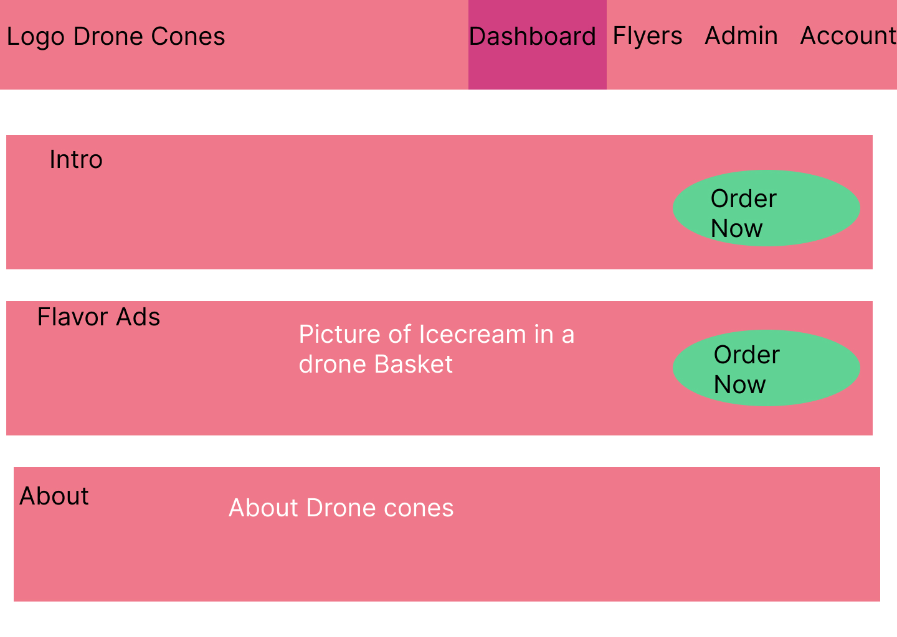
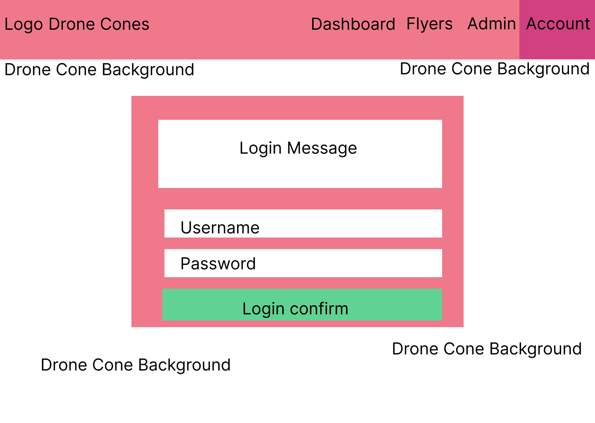
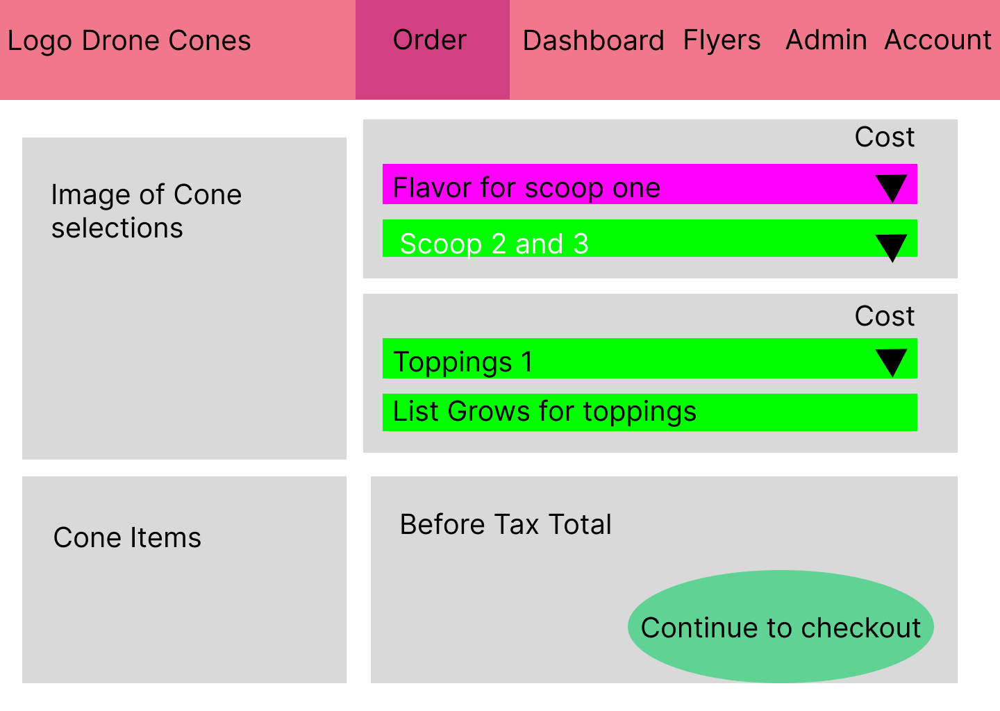

# Low Level Design

### Overall Flowchart

### UML Models

### Screens

Screens list/summary

  <ul>
    <li>Home screen</li>
    <li>Login/sign-up page</li>
    <ul>
        <li>account details</li>
        <ul>
            <li>Passwords, points, history </li>
        </ul>
    </ul>
    <li>Apply Tab ( Flyer applications at minimum) ( Can be the flyer tab)  ( for now mark off a checkbox to immediately become a flyer)</li>
    <li>Form for complaints and questions</li>
    <li>Order screen with options</li>
    <ul>
        <li>payment ( Instant, no qualifying)</li>
    </ul>
    <li>Manager</li>
    <ul>
        <li>Inventory with editable values </li>
        <li>history</li>
    </ul>
    <li>Flyer</li>
    <ul>
        <li>Drone management ( Managers have access ) create new drone</li>
        <li>Order cue</li>
    </ul>
    <li>About (optional)</li>
    <ul>
        <li>Track your order</li>
    </ul>
  </ul>

 

#### Checkout Screen

#### Inventory Screen

#### Account Management Screen

#### Home Screen

#### Login Screen

#### Order Screen

### Models 
**User Table**
- Email
- ID 
- Password
- User role (Consumer, Flyer, Admin)

**Price Table**
- Item  ( IE 1 scoop 2 scoop )
- Price 

**Order History Table**
( Max history size in testing)
- Keeps track of orders and users via foreign keys
- (Track 5 previous orders)
- Order number 
- User ID 
- Sale price 
- Drone ID

**Drone Table**
- Email or User ID 
- size 
- Drone ID
- Active status ( Like are you on vacation?)
- On order / in use or free 
- Orders carried / flight time  ( Compensation for our app )
- Max Battery / max mileage ( Ask about how we measure battery life )

**Inventory Table:**
- Inventory with 'type' column
- Item name 
- Amount 
- units ( stored as servings) 
- cost per unit (maybe )

### Templates 
- TODO psudocode (( the data and returns speciffically))

### Routes
- TODO psudocode

### CSS
 - TODO baseline (( fonts and colors and stuff))