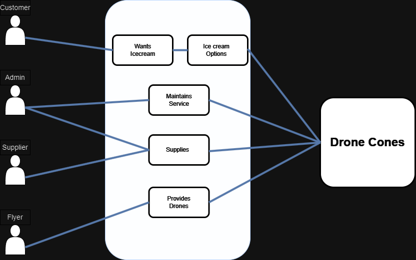

# Requirements

## Base Requirements
- The ability to create an account/login or continue as guest
- Contact form to report incidents, etc.
- Notification system
- Ice cream has a variety of flavors (at minimum 4)
- Different drone sizes (small, medium, large)
- Drone capacity (small = 1, medium = 4, large = 8)
- User account
    - The ability to order ice cream
    - "Track the order"
    - "Pay for the order"
- Flyer account
    - Register as a flyer
    - Compensation based on distance, time, etc.
    - Check compensation
- Admin account
    - Check inventory
    - Manage inventory

## User Stories

### User
- As a user, I want a variety of options for my icecream for when I feel like mint chocolate chip instead of fudge brownie 
  - DOD (Definition of Done): Each admin is required to add at least 4 ice cream flavors when they register.
- As a user, I would like to see my order history and have the ability to quickly reorder an order from my history
  - DOD: Last 5? orders are saved in a list and can be selected. This will place the order without having to change any of the options.
- As a user, I would like to see how long until the drone will be delivering my icecream
  - DOD: A countdown will appear showing how long until the order is expected (static) and a 'map' showing how far the drone has to go.
- As a user, I would like to have more than one flavor of ice cream per cone.
  - DOD: On the order screen, the user has the option to add another scoop of a different flavor. It can be the same flavor as the first scoop or no second scoop at all

### "Flyers" 
- As a flyer, I would like to be compensated by flight time or distance
  - DOD: Flyers are 'compensated' by distance. Distance can probably be randomized. Earnings are shown on a tab on Flyer accounts.

### Developer/Admin
- As an admin, I would like the ability to check inventory so I can know when I need to order more stuff
  - DOD: Inventory is incremented on each order. There is a some notification when certain items need to be reordered.
- As a developer, I need flyers to classify their drones as 'small', 'medium', or 'large' so we can assign a capacity to each drone
  - DOD: small have a capacity of 1, medium have a capacity of 4, and large have a capacity of 8.
- As a developer, I need to have an inventory of drones that are available for use so when an order comes in the app will know what size of drone to send, or how many to send
  - DOD: When an order comes in, drone(s) are selected automatically from the drone inventory. If no drones are available, it will wait until one is available.
  

## Use Cases

## Prototypes
